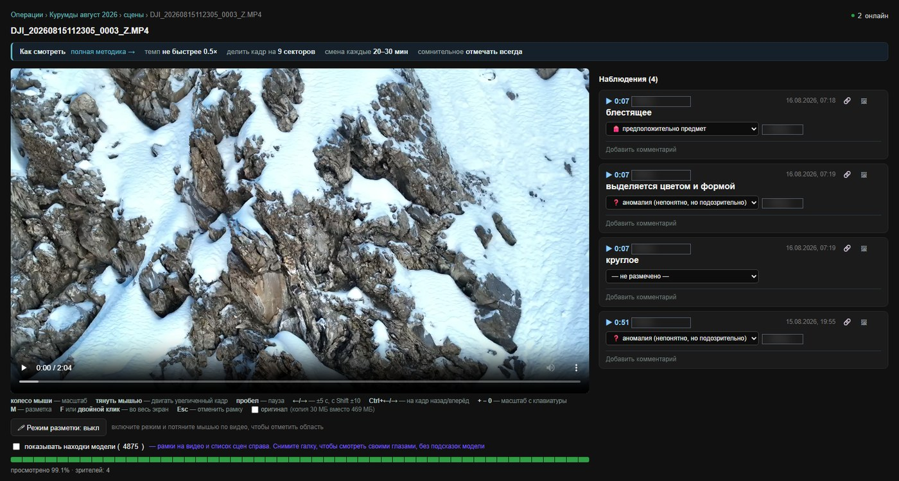

# SAR Review — people searching from UAV in rescue operations

## Get access to application: https://t.me/wildhighbot
## Book a Demo: dmitry.fedotov.dev@gmail.com
## Presentation: https://docs.google.com/presentation/d/1pQqPtfciejIxGGKs3Q5V5xdx2ObYsU6ebdu05y1SO4E/edit?usp=sharing

*[Читать по-русски](README.md)*



*The manual player: mark findings straight on the frame, team observations on the right, and at the bottom a bar showing what a human has genuinely watched. Volunteer names are redacted in this screenshot.*

Self-hosted web service for search and rescue: it reviews drone video and
stills, highlights frames that probably contain a person or equipment, and
helps a team work through the recorded material without watching hours of
footage by hand.

**Built during a real search and rescue operation** — the search for missing
climbers in the Alay district of Kyrgyzstan, near Kurumdy peak. Not a teaching
project: it was used in the field, so the code carries many decisions dictated
by specific problems that surfaced on site (see the "traps" section in
[CLAUDE.md](CLAUDE.md)).

> **This is a tool for prioritising human attention, not a replacement for
> ground teams, repeat flights or standard search protocols.** Every object
> coordinate is a calculated estimate with real error, not a measurement. Read
> the section on coordinates before sending anyone to those numbers.

## What it does

- **Multi-class detection** (YOLOX with no fine-tuning, or your own ONNX model)
  with frame tiling — plus a separate colour-anomaly detector for clothing and
  equipment that object detection often misses at small scale.
- **Grouping thousands of detections into "scenes"** — without it the report is
  unusable at real scale.
- **Object coordinate estimation** from GPS, altitude and gimbal angles,
  accounting for the actual frame zoom. The precise drone coordinates are shown
  separately.
- **Manual player** with mouse/touch marking of findings, bound to the timecode,
  with GPS and a team-wide coverage bar showing what has genuinely been watched.
- **Finding triage** (confirmed person / likely / object / rejected) — the
  status is set by a human only, the system never assigns it.
- **Dataset export** (YOLO) from confirmed findings for fine-tuning.
- **Works without internet** — a fully local service on the operation's network.
- Optional **Telegram bot** for granting volunteers access with coordinator
  approval.

## Requirements

Python 3.10+, ~4 GB of free memory for CPU inference. A GPU is optional but
noticeably faster. Tested on Windows 11 with Python 3.13.

Inference runs through [ONNX Runtime](https://onnxruntime.ai/) (MIT). Weights
are not included in the repository — download YOLOX-s (Apache-2.0) and put it
alongside:

```
https://github.com/Megvii-BaseDetection/YOLOX/releases/download/0.1.1rc0/yolox_s.onnx
```

Or point `sar_config.json` → `model` at your own ONNX model.

## Licence

[MIT](LICENSE).

Dependencies are chosen so the project can be handed to anyone, including in
closed form: ONNX Runtime is MIT, YOLOX weights are Apache-2.0. The
`ultralytics` package (YOLOv8 / YOLO-World) is **deliberately not used** — it is
AGPL-3.0, which would force AGPL onto everything connected to it.

---

## Updating to a new version

```
git pull
```

Your `sar_config.json` is not touched — it is in `.gitignore` and deliberately
kept out of the repository so that an update never overwrites your password and
model settings. Only the template `sar_config.example.json` is in the repo.

If an update adds new parameters to the template that your config does not have,
you can simply append them; anything unspecified falls back to defaults.

## Quick start (web service, self-hosted, multi-user)

**From this version on you need TWO processes running at once** — processing was
moved out of the web server into a separate `sar_worker.py`, precisely so that
restarting or updating the web interface does not interrupt video processing in
progress. Both start from the same folder and read the same `sar_config.json`.

1. Clone the repository into the folder where drone video and stills live (or
   will appear) — that folder becomes `watch_dir`:
   ```
   git clone https://github.com/Dmitry-Fedotov-Dev/sar-review.git
   cd sar-review
   ```
2. Install dependencies:
   ```
   pip install -r requirements.txt
   ```
   (on Windows you sometimes need `python -m pip install -r requirements.txt`)
3. **Once**, copy the template into a working config:
   ```
   copy sar_config.example.json sar_config.json
   ```
   (on Linux/Mac: `cp sar_config.example.json sar_config.json`)

   From then on you only edit `sar_config.json` — leave
   `sar_config.example.json` alone, it is the reference copy in case you want to
   check the defaults or start over.
4. Open `sar_config.json` and change:
   - `"shared_password"` — to a real login password
   - `"model"` / `"model_type"` / `"classes"` — to suit your task
5. Start **both** processes, each in its own console window:
   ```
   python sar_worker.py
   ```
   ```
   python sar_server.py
   ```
   Start order does not matter — whichever comes up first creates the missing
   service files (the database, the `sar_data/` folder).
6. Open `http://<server_address>:8080` in a browser and log in (password plus
   any name).

Video and stills you place **directly in the root** of that folder (no
subfolders — subfolders are deliberately not scanned, see below) are queued
automatically and processed in the background by `sar_worker.py`. The file page
shows live console output and progress while processing runs; once ready, you
get the scene interface with zoom, boxes, GPS coordinates and viewing
statistics, plus a separate manual player with marking and observations.

### Uploading video and telemetry through the browser

Besides copying files into the folder by hand, the file list page has two
buttons — "📤 Upload video" and "📤 Upload telemetry (SRT)" (the second accepts
several files at once — real telemetry usually arrives as a batch from a single
day of flights). Both are visible and functional **only** for someone logged in
under the name `uploader` (case-sensitive, exactly so). This is a temporary
barrier "against accidents", **not real authorisation**: the system has no roles
or accounts at all (one shared password for everyone plus any name at login), so
anyone who knows the shared password can enter the name `uploader` and get
upload access — just as they can get to anything else in the system. The
restriction is a deliberate stopgap until a proper role model exists.

Uploaded telemetry becomes searchable immediately (the `telemetry/` index is
rebuilt on the fly, with no server restart) — but this only affects videos
processed AFTER the upload. Reports that are already finished do not pick up new
telemetry automatically; for those, run `python backfill_telemetry.py`
separately.

### Telegram bot for granting access — `sar_telegram_bot.py`

An optional separate process: it hands volunteers the service link and password
only after the coordinator approves, so access is never posted publicly.
Configured through the `"telegram_bot"` section of the config — see
`sar_config.example.json`. Requires `python-telegram-bot` (included in
`requirements.txt`).

### Telemetry (GPS / altitude / gimbal angles) — the `telemetry/` folder

SRT telemetry is looked for in two places, in order:

1. **Next to the video itself**, same name plus `.srt` (for example
   `DJI_0001.MP4` + `DJI_0001.srt`) — as before, the least ambiguous option.
2. If no such file exists — **recursively inside the `telemetry/` folder** (next
   to the video, created automatically at startup). You can drop SRT files there
   as they are, loose or as whole export folders from a flight (for example
   `telemetry/12.08.2026 Flight subtitles/DJI_0001.SRT`) — subfolders inside
   `telemetry/` are scanned recursively (unlike `watch_dir` itself). An exact
   filename match is tried first; if the names do not match, there is a fallback
   search by the timestamp embedded in the standard DJI filename
   (`DJI_YYYYMMDDHHMMSS_...`), but only when the discrepancy is no more than
   5 minutes — beyond that the system does not guess and leaves the video
   without GPS (better than attaching coordinates from a different flight).

If telemetry is found, GPS, altitude (relative and absolute) and — where the
firmware writes them — gimbal yaw/pitch/roll end up in `detections.json`,
`detections.csv` and in the report's scene cards, with a direct "🗺 map" link to
Google Maps next to the coordinates (both in the report and in the manual
player).

### Detection triage (ranking) — player

Every detection, from the model or manual, has a status dropdown in the player:
**✅ confirmed person · 👤 likely person · 🎒 object · 🎒 likely object ·
❌ rejected** (plus "unmarked" by default). The status is set **by a human
only** — the server never assigns it, neither during processing nor during
backfill; this is a deliberate constraint, and it matters most for "✅ confirmed
person".

Statuses live in the `detection_priorities` table, separate from
`detections.json` / `report.html` — reprocessing a video does not erase them.
For AI scenes the status is bound not to the positional `group_id` (which
changes on reprocessing) but to a fingerprint of the scene's content (class +
source + first frame). The main page shows "🤖 model detections · ✍️ manual"
counters per file and sorting by their sum.

### Dataset export for fine-tuning — `sar_dataset_export.py`

A separate CLI script (like `sar_batch.py` / `backfill_telemetry.py`) that
assembles a YOLO-format dataset from accumulated triage (see above), for
fine-tuning the detector specifically to mountain terrain:

```
python sar_dataset_export.py --out sar_dataset
python sar_dataset_export.py --out sar_dataset --val-split 0.15
python sar_dataset_export.py --out sar_dataset --report-id <id>
```

Only **human-verified** detections are exported —
`confirmed_person` / `confirmed_object` (positives, 2 classes:
`person` / `object`, without the model's finer unverified guess about the exact
type) and `rejected` (the same full frame but WITHOUT a box — a hard negative:
it teaches the model not to confuse that specific pattern, usually a source of
false positives, with the target). `likely_*` and unverified detections are
deliberately excluded.

The train/val split is deterministic by hash — the same image always lands in
the same split across runs, otherwise validation metrics would not be comparable
between runs. Each run rebuilds `images/` / `labels/` from scratch out of the
current triage state: "continuously updating" the dataset means re-running it as
triage grows, not streaming writes in real time. The data consists of real
frames from an active search operation — the dataset is intended for use inside
the team / emergency service only.

### Drone coordinates vs. likely object coordinates

**The difference matters** — the report and the player now show TWO different
coordinate pairs:

- **📍 drone coordinates** — what the SRT telemetry actually records: the GPS of
  the aircraft itself at that frame. Precise (within the drone's GPS accuracy),
  but this is NOT where the detected person or object is — at altitude and at a
  camera angle (and on real flights the altitude can be 1000+ m with a nearly
  horizontal gimbal), an object in frame can be hundreds of metres from the
  point directly beneath the drone.
- **🎯 likely object coordinates** — a geometric ESTIMATE (altitude + gimbal
  angle + the detection box position in frame + the frame's field of view), not
  a measurement. The real error comes from several sources:
  - **zoom IS accounted for** — the FOV is computed per frame from its
    `focal_len` (SRT) and the sensor dimensions
    (`camera_sensor_width_mm` / `_height_mm`, `focal_len_scale` in the config).
    The defaults are for the **DJI M30T zoom camera** (files with the `_Z`
    suffix): a 1/2" 6.4×4.8 mm sensor, `focal_len` in SRT in tenths of a
    millimetre. **A different camera means you must change these**, otherwise
    every estimate will be systematically skewed. The kill switch is
    `use_focal_len_fov: false` (which restores the old behaviour with a fixed
    `camera_hfov_deg`, also used when the SRT has no `focal_len`);
  - **terrain is NOT accounted for** — flat ground at the drone's take-off
    altitude is assumed. In the mountains this is the main source of error:
    error ≈ Δh·tan(angle from nadir), i.e. with a 100 m elevation difference and
    a typical angle that is ~240 m, and at shallow angles (shooting almost along
    a slope) it is kilometres;
  - a 1° gimbal angle error gives anywhere from ~45 m (steep angle) to ~900 m
    (shallow).

  The order of magnitude on this operation's real data (altitude ~1150 m):
  **hundreds of metres when shooting downward, kilometres when shooting close to
  the horizon.** This is a "where to look" pointer, not a survey fix.

  If the camera is pointed at or above the horizon, no estimate is produced at
  all (better no estimate than a knowingly wrong one).

Both coordinate pairs — each with its own "🗺 map" link — appear in the
automatic report (scene card plus full-screen frame view) and in the manual
player (the "Scenes (model)" list on the right).

### Load testing — `sar_loadtest.py`

Answers the question "how many people can the platform take at once" by
measurement rather than by eye. It starts N virtual viewers, each with its own
session, and drives them through a real scenario: file list → report with scenes
→ player → polling for AI boxes.

```
python sar_loadtest.py --users 6 --duration 60
python sar_loadtest.py --users 20 --duration 120 --ramp 20 --json lt.json
```

Results are broken down **per endpoint** and in **percentiles**, not as a single
average: an average hides the dips, and p95 is what a person actually feels. At
the end it names the bottleneck — which step is the slow one.

The module is **read-only**: it places no marks, posts no comments and sends no
heartbeat, so it can be run against a live system. It refuses to hit a
non-local address without an explicit `--allow-remote`: a load test through the
public tunnel would take it down for whoever is searching for people at that
moment.

It does not measure: serving the video itself (that hits network and disk),
browser rendering, or the worker — which is a separate process and is not loaded
over HTTP.

### What the two-process split buys you

- **`sar_server.py` can be stopped, updated or restarted at any moment** —
  video processing in `sar_worker.py` is NOT interrupted and does NOT lose
  progress. The web interface simply stops responding for a few seconds, and
  after the restart it immediately sees the current state (which was being
  written to the shared database the whole time).
- **`sar_worker.py` can be restarted too** (to update its code, for example) —
  the queue and finished results are not lost. But: if a video happened to be
  processing when the worker stopped, it cannot be resumed "from where it left
  off" (the detector has no mid-file resume), and on the next start it simply
  begins from scratch. That is a recomputation, not data loss — just slower.

## Project files

| File | Purpose |
|---|---|
| `sar_server.py` | Web interface: file browser, login, page serving, statistics, the "online" indicator, manual player. Does not start processing itself. |
| `sar_worker.py` | Background processing: watches the folder, queues new files, launches the detector. A separate process, independent of sar_server.py. |
| `sar_common.py` | Shared code between sar_server.py and sar_worker.py (config, DB, folder scanning) |
| `sar_video_review.py` | Detector for video (tiling, grouping into scenes, report) — used by sar_worker.py, and can be run standalone as a CLI |
| `sar_photo_review.py` | The same for single stills |
| `sar_batch.py` | A standalone CLI for queueing / batch-processing a folder of video WITHOUT the web service (when you don't need the web service, just a queue on one machine) |
| `sar_loadtest.py` | Load testing for the web layer: N concurrent viewers, percentiles per endpoint. Read-only, does not modify the database |
| `sar_config.example.json` | Settings template — copy it to `sar_config.json` once, then edit only the copy |
| `requirements.txt` | Python dependencies |

## Important before hosting this outside a LAN or VPN

> **[docs/OPERATIONS.md](docs/OPERATIONS.md) — operations: security,
> resilience, availability.** (Russian.) A breakdown of how the platform breaks
> and leaks in practice: fifteen cases with dates and numbers, from a bot token
> landing in the service's own log to a watchdog that hung for eight days. Read
> it before exposing the platform.

- The password travels without HTTPS — real external access needs a reverse
  proxy (nginx/Caddy) with HTTPS in front of Flask. For use only on the
  operation's LAN or VPN this is an accepted risk.
- `sar_server.py` now starts through `waitress` (production WSGI, pure Python,
  works on Windows) automatically when it is installed
  (`pip install -r requirements.txt` installs it). If `waitress` is not found,
  the server says so in the console and falls back to the Flask dev server — it
  works, but not for sustained production load.
- For permanent operation on a production host, wrap **both** processes
  (`sar_server.py` and `sar_worker.py`) in separate systemd services (Linux) or
  scheduler tasks / NSSM (Windows) with auto-restart — separate, specifically to
  keep the main benefit of the split (updating one does not touch the other).
- Subfolders inside `watch_dir` are **deliberately not scanned** (protection
  against recursively processing the service's own output) — every video or
  still that needs processing must sit in the root.

## CLI mode without the server (for the future / for one-off processing)

```
python sar_video_review.py --video video.mp4 --model yolox_s.onnx \
    --model-type yolox --classes "person,backpack" --out ./review_video1

python sar_photo_review.py --photo photo1.jpg --model yolox_s.onnx \
    --model-type yolox --classes "person,backpack" --out ./review_photo1

python sar_batch.py --input-dir ./videos --out-root ./review_all \
    --model yolox_s.onnx --model-type yolox --classes "person" --workers 1
```

All three modes (CLI, `sar_server.py`, `sar_worker.py`) use the same
`sar_config.json` (not `sar_config.example.json`).

## Tests

```
pip install pytest
pytest
```

Runs with a single command from the project root. The real model (YOLO/torch) is
never invoked in tests — only pure logic and the API are covered, designed to
run in seconds rather than on a GPU. Currently covered: telemetry indexing and
matching (`tests/test_telemetry_index.py`), SRT parsing
(`tests/test_srt_parsing.py`), `sar_worker.py` resilience to failures
(`tests/test_worker_resilience.py`), grouping detections into scenes
(`tests/test_grouping.py`), server cache size limits
(`tests/test_server_cache.py`), video upload through the browser
(`tests/test_upload.py`), the "Scenes (model)" list in the player
(`tests/test_ai_scenes_endpoint.py`), geometric object coordinate estimation
(`tests/test_geolocation.py`, `tests/test_process_video_geolocation.py`),
`backfill_telemetry.py` (`tests/test_backfill_telemetry.py`), load testing
(`tests/test_loadtest.py`), the home link in the report
(`tests/test_report_home_link.py`), "jump to timecode in the player" transitions
from the report (`tests/test_player_deeplink.py`), the access-granting Telegram
bot (`tests/test_telegram_bot.py`), public pages without login
(`tests/test_public_pages.py`), detection triage and the main-page counters
(`tests/test_detection_priorities.py`), YOLO dataset export
(`tests/test_dataset_export.py`), FOV calculation from frame zoom
(`tests/test_fov_from_zoom.py`).
